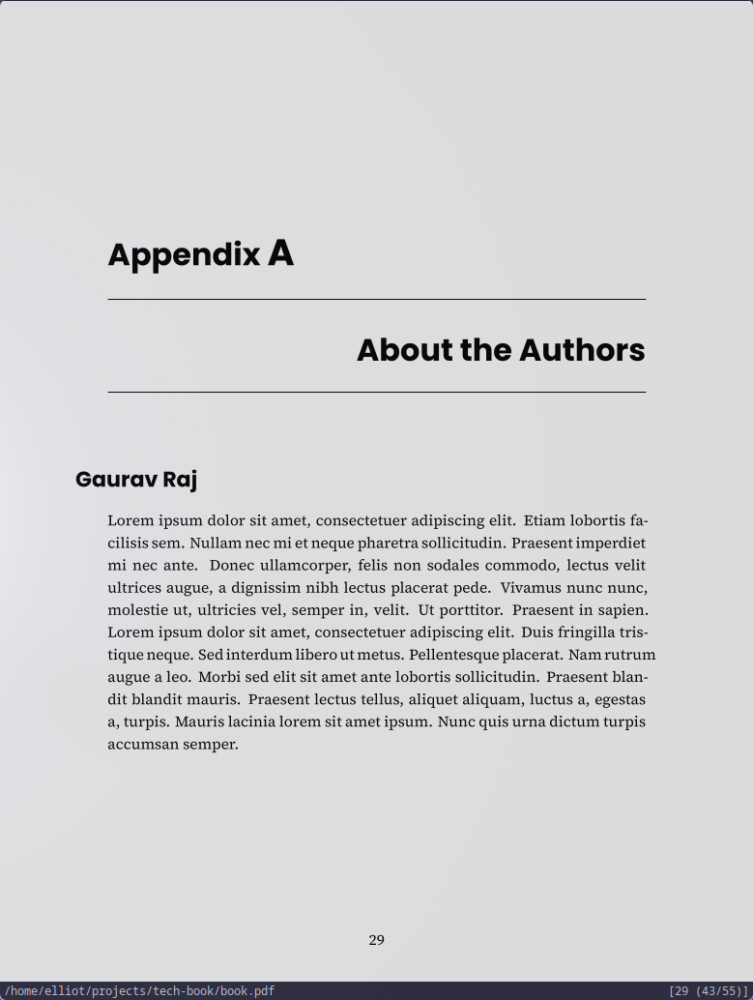
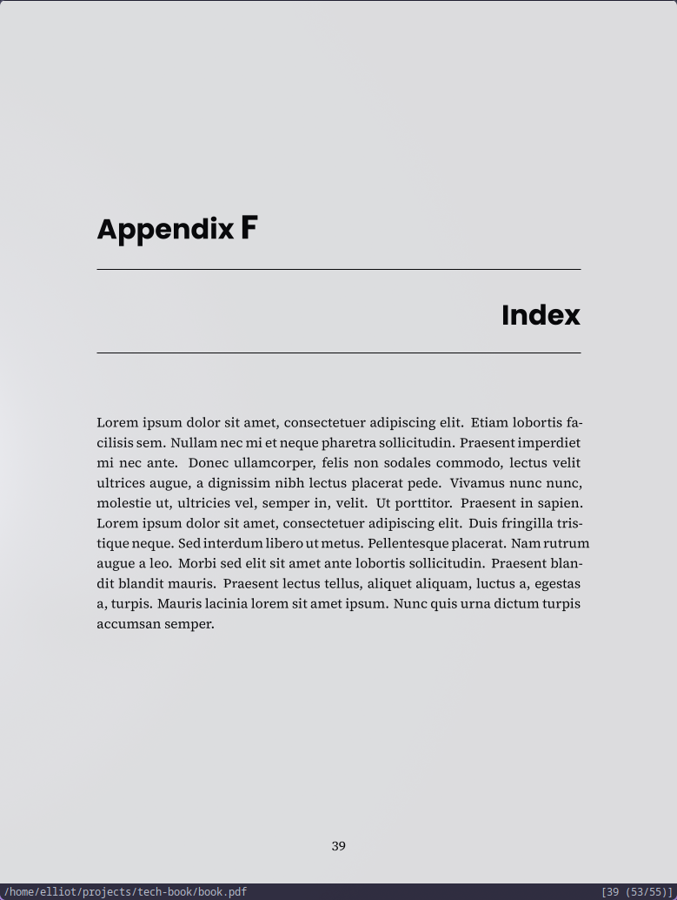

# Tech Book LaTex Template 📘

- LaTex engine: `xelatex`
- Dev Server: `latexmk`

> Note: Don't forget to load fonts
>
> - `FiraMono Nerd Font`
> - `JetBrainsMono Nerd Font`
> - `Poppins`
>
> Either install the fonts system-wide or load via `.ttf` file
>
> Example for loading font locally
>
> ```tex
> \setmainfont[
>   Path = fonts/,
>   UprightFont = *-Regular,
>   BoldFont = *-Bold,
>   ItalicFont = *-Italic,
>   BoldItalicFont = *-BoldItalic
> ]{SourceSerif4}
> ```

## Commands

- Dev Server

```bash
./build.sh run
```

- Build PDF

```bash
./build.sh build
```

<h2>Screenshots</h2>

<table>
  <tr>
    <td></td>
    <td></td>
    <td></td>
  </tr>
  <tr>
    <td></td>
    <td></td>
    <td></td>
  </tr>
  <tr>
    <td></td>
    <td></td>
    <td></td>
  </tr>
</table>
