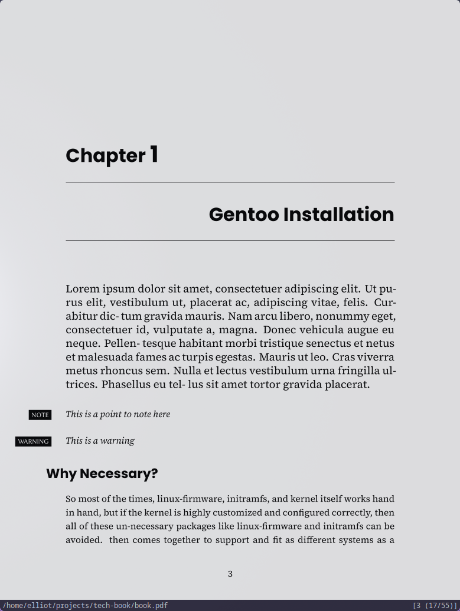

# Tech Book \LaTex Template

- \LaTex engine: `xelatex`
- Dev Server: `latexmk`

> Note: Don't forget to load fonts
>
> - `FiraMono Nerd Font`
> - `JetBrainsMono Nerd Font`
> - `Poppins`
>
> Either install the fonts system-wide or load via `.ttf` file

Example for loading font locally

```tex
\setmainfont[
  Path = fonts/,
  UprightFont = *-Regular,
  BoldFont = *-Bold,
  ItalicFont = *-Italic,
  BoldItalicFont = *-BoldItalic
]{SourceSerif4}
```

## Commands

- Dev Server

```bash
./build.sh run
```

- Build PDF

```bash
./build.sh build
```

## Screenshots





